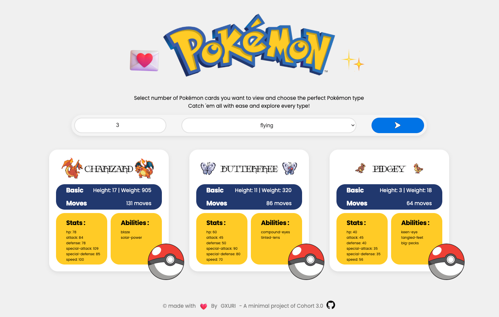

# Pokemon-find

## Description
Pokemon find is a lightweight web application that allows users to search and explore various Pokémon data through the PokeAPI. The goal of this project is to create a seamless experience for Pokémon enthusiasts to quickly access Pokémon information.

## Thought Process
During the development of Pokemon find, I aimed to create a minimalistic interface , with vanila html css and js and also how api works with js and how will i update the dom as per data

## API Integration
The application utilizes the [PokeAPI](https://pokeapi.co/) to fetch Pokémon data. The API provides a wide range of information, including Pokémon attributes, types, abilities, and much more. The key endpoints used in the application are:
- `/pokemon`: For retrieving basic Pokémon information.
- `/type`: To get details about different Pokémon types.
## Rough Draw
 

### How It Works
1. The user enters a Pokémon name or ID in the search bar.
2. The application makes an API call to PokeAPI to retrieve data related to the entered Pokémon.
3. The fetched data is then displayed in a user-friendly format, allowing users to explore various attributes.

## Shout-Out
A special thanks to Harkirat for their support throughout the development of this project!

## Shout-Out to PokeAPI
A special thanks to [PokeAPI](https://pokeapi.co/) for providing an amazing API that made this project possible. Their extensive database allowed me to focus on creating a great user experience rather than building a backend from scratch.

## Installation
To run this project locally, follow these steps:
1. Clone the repository: `git clone https://github.com/Gurvinder-Singh02/PokeQuest.git`
2. Navigate to the project directory: `cd PokeQuest`
3. Open the `index.html` file in your web browser.

## License
Feel free to use this project

